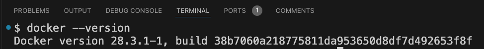
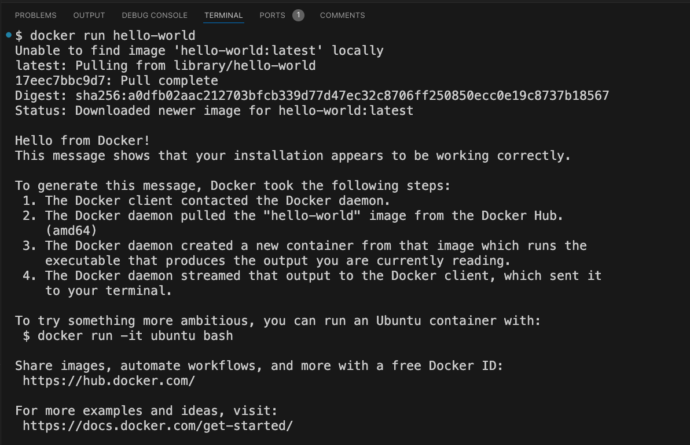
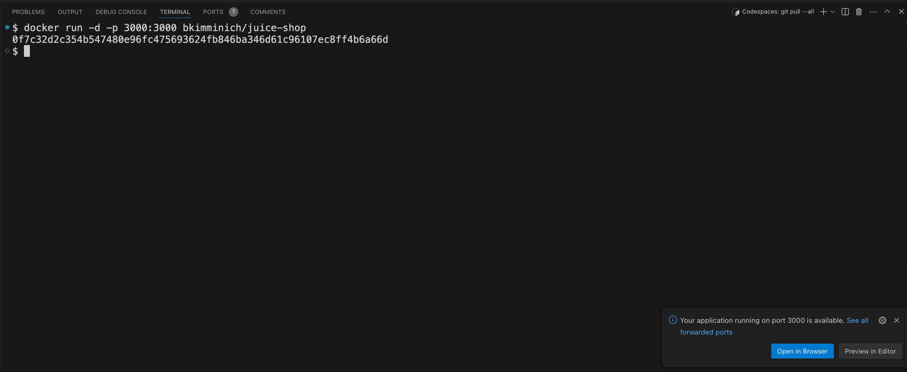
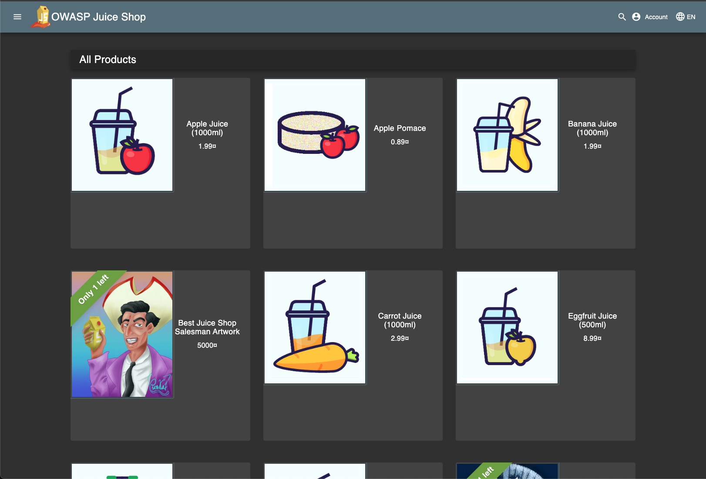

# 🔧 Setting Up the Envrionment (Docker and Owasp Juice Shop)
---

## 🐳 Step 1 — Check Docker   
`docker --version`

`docker run hello-world`

---

## 🍹 Step 2 — Launch OWASP Juice Shop 
`docker run -d -p 3000:3000 bkimminich/juice-shop`

---

## 🌐 Step 3 — Access the App 
Docker will pull the image and start the app. Open your browser and go to:
http://localhost:3000

---

## 🎯 Step 4 — OWASP Juice Shop Live in the Cloud  

You now have **OWASP Juice Shop** up and running!  

- 🖥️ Inside **GitHub Codespaces**  
- 🚫 No local setup needed  
- 🎯 Practice with:  
  - ✅ Vulnerability Scanning  
  - ✅ Attacks & Exploits  
  - ✅ Security Hardening  

---

## 🔮 What’s Next  

- You built a **working lab** 🧪  
- Ready to **scan, attack & secure**  
- Next: discover the **tools** 🛠️  