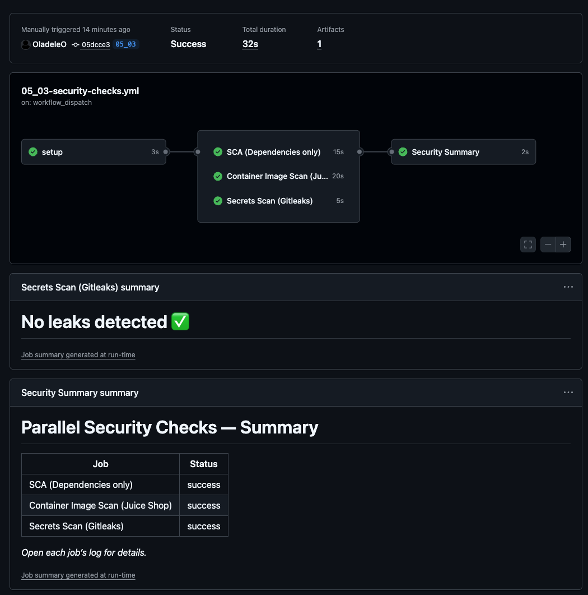

# Parallelizing Security Checks for Faster Execution

---

## Why Run Security Scans in Parallel?

In modern pipelines, **speed is everything**. If security scans take too long, developers will skip them.  
By running checks in **parallel**, we get **fast feedback** without compromising coverage.  

This pipeline shows how to split security checks into **independent jobs**:
- Dependency vulnerabilities (SCA)  
- Container image vulnerabilities  
- Hardcoded secrets  

Each runs at the same time, then a summary collects results at the end.

---

## Job Breakdown

### 1. Setup
Checks out the repository so all jobs use the same codebase.

### 2. SCA (Trivy FS)
Scans the source code for **dependency vulnerabilities** (library-level issues).

### 3. Image Scan (Trivy Image)
Scans the official Juice Shop container image, checking both:
- **OS packages** (base image issues)  
- **Libraries** (application-level issues)

### 4. Secrets Scan (Gitleaks)
Detects **hardcoded secrets** in the repository (tokens, keys, passwords).

### 5. Summary
Collects the status of all jobs and shows them in a single table at the end of the workflow.

---

## Key Benefits

- **Faster feedback:** scans run in parallel, not one after another.  
- **Broader coverage:** different layers (code, image, secrets) are checked at once.  
- **Clear results:** final summary shows the health of each scan.  

---

## Result

The workflow produces a clear summary table at the end of the run in GitHub Actions.

---

## Wrap-Up

This workflow demonstrates how to integrate **parallelized security checks** without slowing development.  
In the **next lesson**, we’ll enhance the pipeline with **SBOM generation** and **SARIF reporting**, making results visible inside GitHub Security.

