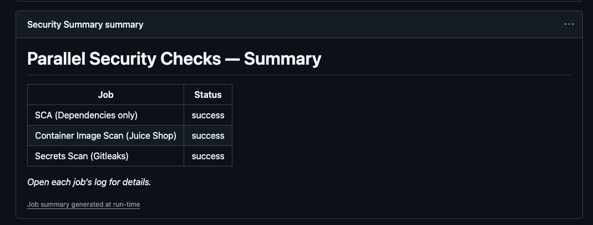

# Parallelizing Security Checks for Faster Execution

---

## Why Run Security Scans in Parallel?

In modern CI/CD pipelines, **speed is everything**.  
If security scans take too long, developers will be tempted to skip them.  

By running checks in **parallel**, we get:
- **Fast feedback** (minutes instead of tens of minutes)  
- **Full coverage** across multiple security layers  
- **Happier developers** who don’t feel slowed down  

This workflow splits security checks into **independent jobs**:
- Dependency vulnerabilities (SCA)  
- Container image vulnerabilities  
- Hardcoded secrets  

Each runs **at the same time**, then a **summary** collects results at the end.

---

## Job Breakdown

### 1. Setup
Checks out the repository so all jobs use the same codebase.

💡 **Quick Note**  
All jobs run on **Ubuntu runners** (`runs-on: ubuntu-latest`).  
Each job starts from a **clean VM**, so tools installed in one job (like Node.js or Trivy) do **not carry over** to the next job.  
That’s why we re-install dependencies (like Node.js) in the `sca-trivy-fs` job.

---

### 2. SCA (Trivy FS)
Scans the source code for **dependency vulnerabilities**.  
These are vulnerabilities in libraries you install (e.g., via `npm`).

- Runs **Trivy** in `fs` (filesystem) mode  
- Generates a lockfile (`package-lock.json`) for reliable scanning  
- Detects vulnerable packages used by the app  

---

### 3. Image Scan (Trivy Image)
Scans the official **Juice Shop container image** (`bkimminich/juice-shop:latest`).

Checks for vulnerabilities in:
- **OS packages** (Ubuntu base image, system libs)  
- **Application libraries** inside the container  

This gives visibility into risks **inside your container**, not just the code.

---

### 4. Secrets Scan (Gitleaks)
Uses **Gitleaks** to detect **hardcoded secrets** such as:
- API keys  
- Database passwords  
- Tokens  

Even public repos can accidentally leak sensitive values — this step catches them.

---

### 5. Summary
Collects the status of all jobs and presents them in a **clear table** at the end.  

This way, developers don’t need to dig through every log — they can see at a glance what passed and failed.

---

## Key Benefits

- **Faster feedback** → scans run in parallel, not one after another.  
- **Broader coverage** → dependencies, images, and secrets checked together.  
- **Clear results** → summary table makes issues easy to understand.  

---

## Pipeline Shape

---

## Result

The workflow produces a clear summary at the end of the run in GitHub Actions:

---

## Wrap-Up

This workflow shows how to integrate **parallelized security checks** into CI/CD without slowing development.  

In the **next lesson**, we’ll enhance this pipeline with:
- **SBOM generation**  
- **SARIF reporting** (to see results directly in GitHub Security tab).  

This way, your pipeline not only runs fast but also provides **actionable visibility** for developers and security teams.