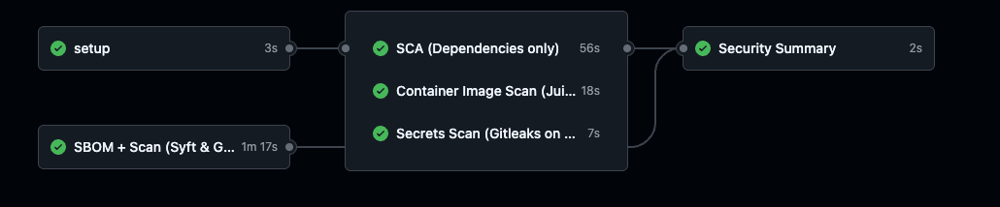

# 05_04 — Adding SBOM Generation and Scanning

---

## Why Add SBOMs?

In the previous lesson, we ran **parallel security scans** (SCA, image scan, secrets).  
Now we’re taking it a step further by introducing **SBOMs (Software Bill of Materials)**.  

An SBOM is like an **ingredients list for your software**.  
It tells us *exactly* what’s inside an application or container.  

With an SBOM, we can:
- Re-scan later without rebuilding the image  
- Share a standard artifact with auditors or security teams  
- Detect vulnerabilities consistently using tools like **Grype**

---

## Job Breakdown

### 1. Setup
Same as before — we check out the repository.  
All jobs run on **Ubuntu runners** (`runs-on: ubuntu-latest`).

---

### 2. SCA (Trivy FS)
Scans the source code for **dependency vulnerabilities** (via `npm` lockfile).  

- Uses **Trivy in FS mode**  
- Focuses on vulnerable libraries your app installs  

---

### 3. Image Scan (Trivy Image)
Scans the **Juice Shop Docker image** (`bkimminich/juice-shop:latest`).  

- Finds issues in the **OS base image**  
- Finds issues in **application dependencies** inside the image  

---

### 4. Secrets Scan (Gitleaks)
Runs **Gitleaks** against the source code to find **hardcoded secrets**.  

- API keys  
- Tokens  
- Passwords  

---

### 5. SBOM + Scan (Syft & Grype)

#### a) Generate SBOM  
We use **Syft** to generate a **CycloneDX SBOM** for the Juice Shop image.  
This file is uploaded as an artifact for later reference.

#### b) Scan SBOM with Grype  
Then we feed that SBOM to **Grype**, producing a **JSON report** that is uploaded as an artifact.  

This ensures:
- **Portable reports** you can download and share  
- **Auditable evidence** of vulnerabilities  

---

### 6. Summary
At the end, we collect the status of **all four jobs** in a single summary table.  

| Job | What it checks |
|-----|----------------|
| SCA (Trivy FS) | Dependency vulnerabilities |
| Container Image Scan | OS + app vulnerabilities in the container |
| Secrets Scan (Gitleaks) | Hardcoded secrets |
| SBOM (Syft + Grype) | Vulnerability scanning of the generated SBOM |

---

## Key Benefits

- **Full coverage** → code, container, secrets, and SBOM  
- **Reusable artifacts** → JSON & SBOM files can be downloaded  
- **Still parallel** → no slowdown for developers  

---

## Pipeline Shape

---

## Result

At the end of the workflow, you get:
- A **summary table** in the job logs  
- **Artifacts** you can download (SBOM JSON + Grype JSON)  

---

## Wrap-Up

With this workflow, we’ve extended our parallel security checks to include **SBOM generation and scanning**.  
This makes your pipeline:
- Faster  
- More transparent  
- More compliant with real-world supply chain security needs.  

In the next lessons, we’ll look at **reporting enhancements** and how to integrate these scans into developer workflows.